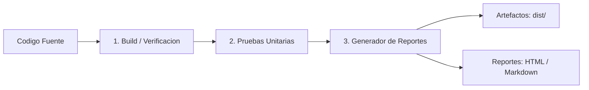

# Sistema de Gestion de Productos (CRUD) + Pipeline CI/CD

Una aplicacion web agil y responsiva para la Gestion de Productos construida con HTML5, CSS3 y JavaScript (Vanilla), que incorpora una herramienta de construccion automatizada, integracion continua (CI) con GitHub Actions, pruebas unitarias automatizadas y generacion de reportes detallados.

---

## Integracion Continua y Automatizacion (Pipeline CI)

Este proyecto incluye una configuracion completa de integracion continua implementada tanto para la nube (GitHub Actions) como para ejecucion local (Scripts de Node.js).

### Comandos del Pipeline

| Comando | Accion | Descripcion |
| :--- | :--- | :--- |
| `npm run ci` | **Pipeline Completo** | Ejecuta compilacion, pruebas y generacion de reporte en secuencia |
| `npm run build` | **Compilacion / Build** | Valida sintaxis, optimiza codigo y genera la carpeta de distribucion `dist/` |
| `npm test` | **Pruebas Automatizadas** | Ejecuta la suite de 15 pruebas unitarias automatizadas |
| `npm run report` | **Generacion de Reportes** | Genera reportes en formato HTML interactivo, Markdown y JSON |
| `npm run lint` | **Verificacion de Sintaxis** | Analiza la sintaxis de todos los archivos JavaScript del proyecto |

---

## Estructura del Pipeline CI



1. **Compilacion / Build Automatizado (`scripts/build.js`)**:
   - Valida la sintaxis de todos los scripts del proyecto.
   - Limpia y genera la carpeta de produccion `dist/` con el codigo organizado.
   - Crea un manifiesto de compilacion `dist/build-info.json` con metricas de tamano y tiempo.

2. **Pruebas Automatizadas (`tests/products.test.js`)**:
   - 15 casos de prueba unitarios automatizados que cubren:
     - Validacion de nombres de producto (longitud 4-9 letras, mayuscula inicial, rechazo de caracteres invalidos).
     - Validacion de precios (numeros positivos enteros/decimales, rechazo de ceros, negativos o cadenas).
     - Validacion de categorias (longitud 3-15 letras, caracteres permitidos).
     - Logica de negocio CRUD (filtrado y busqueda insensible a mayusculas).

3. **Generacion de Reportes (`scripts/generate-report.js`)**:
   - **`reports/ci-report.html`**: Panel interactivo con diseno moderno, metricas, porcentajes de aprobacion y tiempos.
   - **`reports/ci-report.md`**: Resumen en Markdown listo para Pull Requests o GitHub Step Summary.
   - **`reports/test-results.json`**: Resultados estructurados para integracion con herramientas externas.

4. **Integracion con GitHub Actions (`.github/workflows/ci.yml`)**:
   - Se ejecuta automaticamente en cada `push` o `pull_request` a las ramas `main` y `master`.
   - Compila, prueba, genera reportes y publica los artefactos automaticamente en GitHub.

---

## Estructura del Proyecto

```
Repositorio-Crud/
├── .github/
│   └── workflows/
│       └── ci.yml             # Flujo de trabajo de GitHub Actions (CI)
├── css/
│   ├── all.min.css
│   ├── bootstrap.min.css
│   └── style.css              # Estilos visuales del sistema
├── js/
│   └── main.js                # Logica del CRUD compatible con navegador y Node.js
├── tests/
│   └── products.test.js       # Suite de 15 pruebas unitarias automatizadas
├── scripts/
│   ├── build.js               # Script de compilacion y verificacion
│   ├── generate-report.js     # Generador de reportes (HTML, MD, JSON)
│   └── ci.js                  # Orquestador del pipeline CI
├── dist/                      # Artefactos compilados listos para produccion
│   ├── build-info.json
│   ├── index.html
│   └── js/
├── reports/                   # Reportes generados por el pipeline CI
│   ├── ci-report.html
│   ├── ci-report.md
│   └── test-results.json
├── index.html                 # Pagina principal del aplicativo en espanol
├── package.json               # Configuracion de scripts y metadatos
└── README.md                  # Documentacion del proyecto
```

---

## Ejecucion Rapida

1. **Abrir la aplicacion web**:
   - Abre `index.html` (o `dist/index.html`) directamente en cualquier navegador web.

2. **Ejecutar el pipeline de CI**:
   ```bash
   npm run ci
   ```
   O de forma individual por etapas:
   ```bash
   npm run build
   npm test
   npm run report
   ```

3. **Ver el reporte de pruebas**:
   - Abre `reports/ci-report.html` en tu navegador para ver el panel de resultados.
